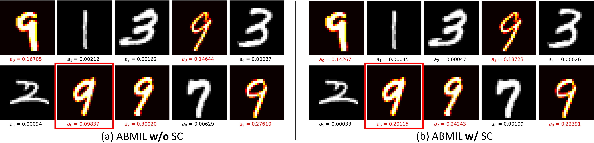

# SCMIL
This repository contains official implementation for the paper titled "SC-MIL: Sparsely Coded Multiple Instance Learning for Whole Slide Image Classification"

## News :fire:
- **April 25, 2024:** The core code of the SC-MIL has been released.

> **Abstract.**   Multiple Instance Learning (MIL) has been widely used in weakly supervised whole slide image (WSI) classification. Typical MIL methods include a feature embedding part, which embeds the instances into features via a pre-trained feature extractor, and an MIL aggregator that combines instance embeddings into predictions. Most efforts have typically focused on improving these parts. This involves refining the feature embeddings through self-supervised pre-training as well as modeling the correlations between instances separately. 
  In this paper, we proposed a sparsely coding MIL (SC-MIL) method that addresses those two aspects at the same time by leveraging sparse dictionary learning. The sparse dictionary learning captures the similarities of instances by expressing them as sparse linear combinations of atoms in an over-complete dictionary. In addition, imposing sparsity improves instance feature embeddings by suppressing irrelevant instances while retaining the most relevant ones. To make the conventional sparse coding algorithm compatible with deep learning, we unrolled it into a sparsely coded module leveraging deep unrolling. The proposed SC module can be incorporated into any existing MIL framework in a plug-and-play manner with an acceptable computational cost. The experimental results on multiple datasets demonstrated that the proposed SC module could substantially boost the performance of state-of-the-art MIL methods. 

> **Architecture**


### Toy MNIST Example 



## Future Updates
- [x] Release the tentative code for 2D segmentation.

## Citation
If you find our work is useful in your research, please consider raising a star  :star:  and citing:

```
@article{qiu2023sc,
  title={SC-MIL: Sparsely Coded Multiple Instance Learning for Whole Slide Image Classification},
  author={Qiu, Peijie and Xiao, Pan and Zhu, Wenhui and Wang, Yalin and Sotiras, Aristeidis},
  journal={arXiv preprint arXiv:2311.00048},
  year={2023}
}
```